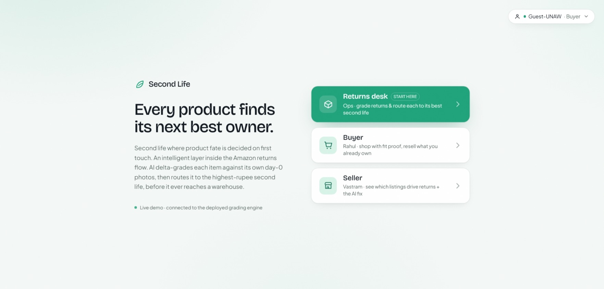
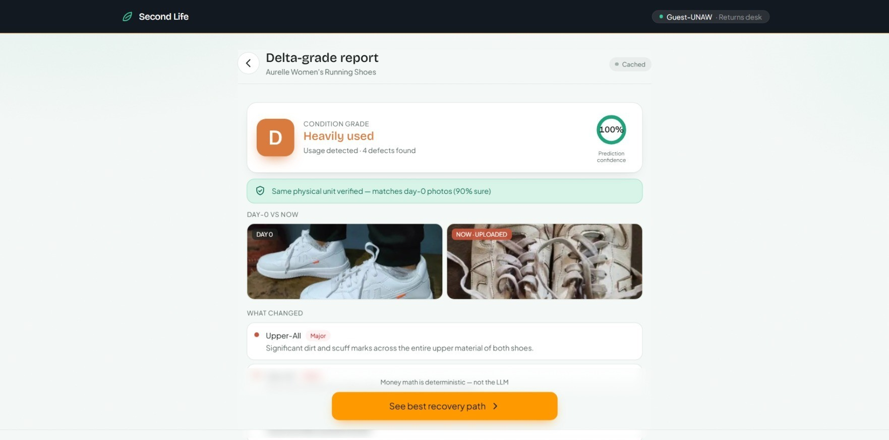
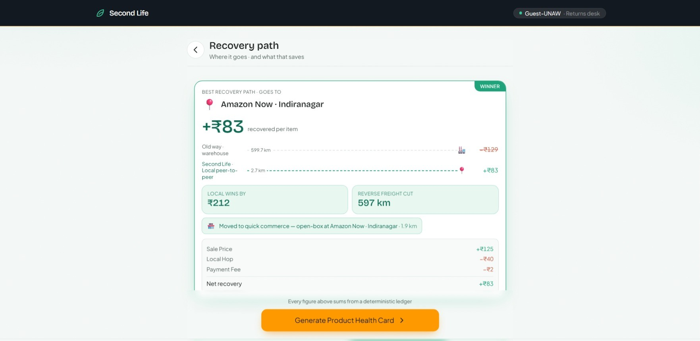
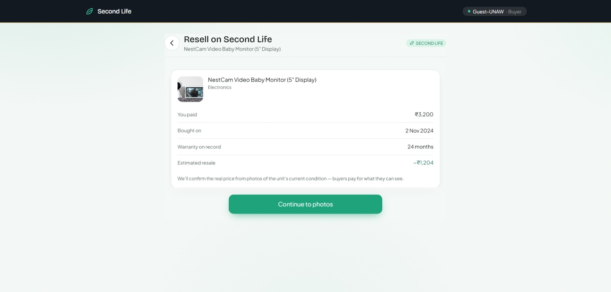
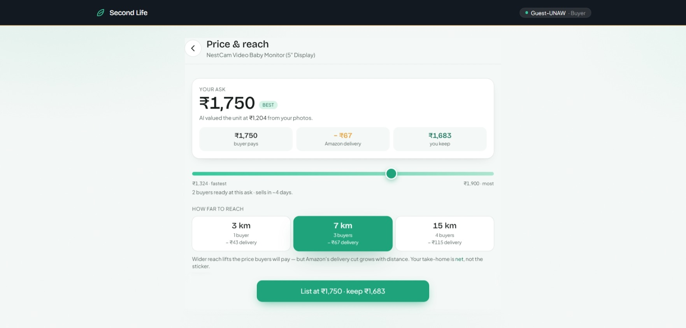
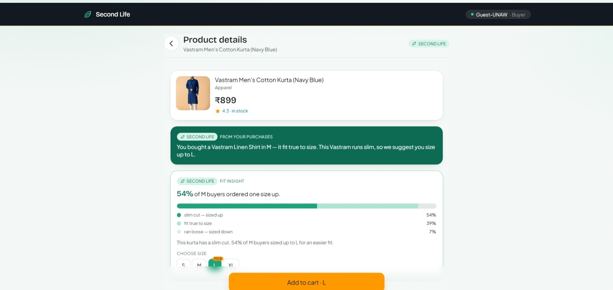

# Amazon Second Life

**Every product finds its next best owner.**

A layer *inside* the Amazon order flow that gives returned, unused, and outgrown
products a second life instead of a one-way trip to a warehouse or a landfill. Built for
**HackOn with Amazon — Season 6** (Stores track · *"Products Without a Second Chance"*).

- **Live demo:** https://amazon-hackon.vercel.app



---

# Problems We're Solving

Three problems in the returns-and-resale economy — all rooted in the same gap: a product's fate is decided too late, too centrally, and at too much cost.

---

## 1. Returns travel all the way back before anyone decides their fate

Only **~48% of returned items are ever resold at full price**. The remaining products lose value through liquidation, markdowns, refurbishment costs, or disposal.

Today, a returned product is typically shipped back to a centralized returns facility before anyone decides whether it should be resold, refurbished, donated, liquidated, or discarded. By the time that decision is made, the economics are often already broken.

* Reverse logistics consumes **20–30% of an item's original value**.
* Processing a single return costs approximately **$10–$65 per item**.
* Global e-commerce returns now exceed **$640B annually**.
* In India, reverse logistics can cost **₹200–₹400 per returned item**, often exceeding the margin on lower-value products.

For many products, especially low-margin ones, the return journey costs more than the value that can be recovered. As a result, usable products are liquidated in bulk or never find a second owner.

---

## 2. People want to resell, but privacy and friction keep supply locked away

Demand for secondhand products has never been stronger.

* The global resale market is estimated between **$188B and $594B**.
* Approximately **60% of online shoppers in India already purchase secondhand goods**.

Yet millions of perfectly usable products remain idle in homes because reselling is inconvenient and often feels unsafe. Traditional peer-to-peer platforms require sellers to expose personal contact details, communicate with strangers, negotiate manually, and arrange physical meetups.

The demand exists. The inventory exists. The trust layer does not.

As a result, products that could easily find another owner remain unused while buyers continue purchasing new replacements.

---

## 3. Most returns aren't defective — they're avoidable

The majority of online returns happen because the product was not what the customer expected, not because it was damaged.

* Global e-commerce return rates average **19–20.5%**.
* Fashion return rates in India reach **25–40%**.
* **45–52% of returns are driven by sizing and fit issues alone**.
* **63% of shoppers now practice "bracketing"** — ordering multiple sizes or variants with the intention of returning most of them.

Every one of these returns still triggers transportation, inspection, handling, repackaging, and processing costs.

Most of these products are perfectly functional. Yet they still travel through an expensive reverse-logistics pipeline before a decision is made about their next best use.

---

### Sources

* NRF *2025 Retail Returns Landscape*
* Eightx
* Richpanel
* TrackVid
* Claimlane (2026)
* Loop Returns (2026)
* Statista Consumer Insights
* ThredUp (2026)
* Shipway (2024)
* Edgistify

## The idea

A return is not a logistics problem. It is an **information-destruction problem**.

When the shoes were bought, Amazon already held everything about them: catalog photos,
specs, price history, the invoice, demand signals. The moment they're returned, all of it
is treated as dead — the item becomes an anonymous object that must be expensively
*re-identified*: re-photographed, re-described, re-priced, re-inspected. That
re-identification labor is the ₹220 that exceeds the ₹150 margin.

The only genuinely new fact about a returned product is **its current condition**. Capture
that condition in about two seconds with a phone camera and the relisting cost collapses
toward zero. The premium-versus-cheap asymmetry disappears, and no product is too cheap to
save.

This is only possible for Amazon — catalog, order history, invoices, lockers, payment
trust, and a last-mile fleet. A standalone marketplace structurally cannot copy it.

## How it works — the core flow

Whether a returns agent scans a unit at handoff or an owner resells a dormant product from their order history, the item moves through five stages — each backed by real API calls you can audit in the network tab.

### 1. Scan and delta-grade

The grader compares the **current photos against that unit's own day-0 "birth-certificate"
photos** — not a generic catalog image — and returns the *delta*: localized defects with
severity, a grade A–D, a confidence score, and a same-unit check that flags swap fraud and
worn-then-returned items. Low-confidence grades route to a human queue.




### 2. Value Recovery Score

A deterministic engine prices six recovery paths (local P2P, warehouse relist, refurbish,
liquidate, donate, sealed RTO relist), nets each against its real costs, and routes the
item to its highest-rupee path — **showing the math**. On the worn ₹500 shoe, a local hop
recovers **+₹83** against the warehouse round-trip's **−₹129**: a ₹212 swing, and 597 km
of reverse freight cut. The cascade strip shows where the item goes next, week by week, if
it doesn't sell locally.



### 3. Product Health Card

A transferable trust record travels with the item: provenance, the grading report,
remaining **warranty that transfers to the next owner** (because Amazon holds the original
invoice), and a price-decay curve that prices in the urgency to list now.


### 4. Idle Asset Radar

Order history is a map of dormant inventory sitting in millions of homes. The radar inverts
the marketplace — **demand activates supply**: when buyers search nearby, owners of a
matching dormant unit get a one-tap resell nudge priced from the same engine.


### 5. Peer-to-Peer Resell

Owners can list dormant products directly from their order history using a **two-step resell flow**. The owner confirms purchase details and uploads current photos to run the AI grader. Based on the grade and local demand, a range-pricing slider lets them balance reach (local delivery cost) against available buyers to optimize their net payout, listing the item instantly to the public Flash Deals board.




> **The design rule:** the vision model is a *perception layer only*. Every rupee on screen
> comes from deterministic Python and a real API field — never hardcoded in the UI — so the
> math is auditable. A failed live model call falls back to a committed cached response and
> the screen looks identical.

## Two-sided console — prevent, recover, recirculate

The recovery flow above is the centerpiece. Around it, the console covers the full lifecycle
a product can hit, across three entry points on the landing page.

**Recover** is the agent flow above. **Recirculate** is the buyer storefront — shop with fit
proof, resell what you already own, and meet recovered units on the normal product page.
**Prevent** is the seller dashboard — a worst-first return-rate table where tapping a
high-return listing shows the AI-diagnosed fix (for example, *"your photos show navy;
returned units photograph royal blue"*) and the projected return-rate drop.

| Buyer storefront | Seller dashboard |
|---|---|
|  |  |

## Architecture

```
React 19 + Tailwind v4 (Vite)  ──►  FastAPI on AWS Lambda (container, ca-central-1,
   web console on Vercel               Function URL) + Mangum
                                          │
                                          ├─ Perception: Gemini 2.5 Flash (primary)
                                          │              → Bedrock Nova 2 Lite (failover)
                                          │              → committed cached response
                                          ├─ Money math: deterministic Python (VRS, pricing)
                                          └─ Product Passport: DynamoDB event log
                                             (behind DYNAMODB_TABLE_NAME; in-memory fallback)
```

- **Provider-agnostic perception.** Primary and fallback are env-driven
  (`LLM_PRIMARY` / `LLM_FALLBACK`). Gemini Flash has free-tier headroom; Nova 2 Lite on AWS
  credits is the always-available backstop. Both are vision-capable, so failover covers the
  multimodal calls.
- **The demo never blocks.** Repo-baked seed items and committed cached AI responses, plus a
  `FORCE_CACHED=1` kill switch, mean a failed live call on stage is invisible. A DynamoDB
  outage degrades to an in-memory store. When a cache serves an uploaded photo, the UI says
  so plainly rather than passing it off as live analysis.

Full system design, the VRS constants, the grading prompt, and the production pipeline are
in [docs/architecture.md](docs/architecture.md).

## Run it locally

**Backend** (Python 3.11+):

```bash
cd backend
pip install -r requirements.txt
# create .env from .env.example (GEMINI_API_KEY, AWS creds for the Bedrock failover, etc.)
uvicorn app.main:app --reload --port 8080
```

**Frontend** (Node 18+):

```bash
cd frontend
npm install
npm run dev        # http://localhost:5173  — use localhost, not 127.0.0.1 (CORS is origin-exact)
```

`frontend/.env.local` can point `VITE_API_URL` at a local backend; it defaults to the
deployed Function URL, so the frontend runs against production with no local backend.

## Deploy

- **Frontend** auto-deploys to Vercel on `git push origin main`.
- **Backend** — `cd backend; ./deploy.ps1` (Docker must be running) builds the container,
  pushes to ECR, and updates the Lambda.

## Environment variables (backend)

| Variable | Purpose |
|----------|---------|
| `LLM_PRIMARY` / `LLM_FALLBACK` | provider chain — defaults `gemini` / `bedrock` |
| `GEMINI_API_KEY`, `GEMINI_MODEL` | Gemini perception (`gemini-2.5-flash`) |
| `BEDROCK_MODEL_ID`, `AWS_REGION` | Bedrock Nova failover |
| `DYNAMODB_TABLE_NAME` | enable the persistent passport + demo stores (optional) |
| `ALLOWED_ORIGINS` | CORS allowlist (defaults to localhost + the Vercel app) |
| `FORCE_CACHED` | `1` → serve only cached AI responses (stage kill switch) |
| `METRICS_RESET_TOKEN` | token gating `POST /metrics/reset` (presenter tool) |
| `ENABLE_CHAT` | `1` → re-enable the legacy `/chat` endpoint (off by default) |

## Repo layout

```
backend/app/    FastAPI app — grading, vrs, pricing, healthcard, radar, inspection,
                resell, returns, buyer, your_things, green_ledger, store (DynamoDB), …
backend/tests/  VRS reconciliation + hero golden + cache-floor guard
backend/scripts/ cache capture + failover drill
frontend/src/   React screens (the web console) + lib/api.js
docs/           PRD, architecture, api-spec, screenshots
```

## Documentation

- [docs/PRD.md](docs/PRD.md) — the submission deliverable
- [docs/architecture.md](docs/architecture.md) — system design, VRS math, GenAI core, failover path
- [docs/api-spec.md](docs/api-spec.md) — every endpoint
