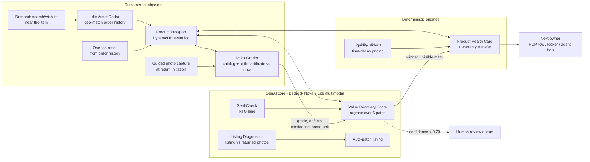

# Architecture — Amazon Second Life

## 1. System overview (demo build)

```
[Browser: phone-frame React UI on Vercel]
        │  HTTPS (VITE_API_URL)
        ▼
[AWS Lambda Function URL · ca-central-1 · FastAPI + Mangum, container via ECR]
        │
        ├── Seed store (repo-baked JSON + images): items, passports, orders,
        │   neighbors/demand, cached AI responses
        ├── Grading engine ──► Bedrock Nova 2 Lite (multimodal, converse API)
        │                      └─(failure/timeout)──► Gemini 2.5 Flash (vision)
        │                      └─(both fail)────────► cached response for item
        ├── VRS economics engine (pure Python — deterministic, auditable)
        ├── Pricing / time-decay / liquidity-curve module (pure Python)
        ├── Health Card assembler (passport + grade + invoice + warranty calc)
        ├── Idle Asset Radar (geo match over seeded order history)
        └── Passport event log ──► DynamoDB (if DYNAMODB_TABLE_NAME set)
                                   └─(unset/error)──► in-memory store seeded from JSON
```

**Design principle: the LLM is a perception layer. The money math is code.** Bedrock sees photos and returns structured condition facts; the VRS engine turns facts into rupee decisions deterministically. This is what separates us from chatbot wrappers — and it's why the demo can show its math.

## 2. Mermaid diagram (use in PRD/deck)



## 3. GenAI core — the three Bedrock calls

All three use the existing `llm.py` failover pattern, extended with image content blocks and JSON-constrained output. `temperature=0.2` for grading (consistency > creativity). Every response is validated against a Pydantic schema; invalid JSON → one retry with the validation error in the prompt → then cached fallback.

### 3.1 Delta-Grader (`POST /grade`)
**Input images:** 1 catalog image + 2 birth-certificate (day-0) photos + 2–3 current photos.
**Prompt skeleton (final wording iterated in MT1):**
> You are a returns inspector. Compare the CURRENT photos against the CATALOG image and this unit's DAY-0 photos. Return ONLY JSON matching the schema. Tasks: (1) same_unit: is this physically the same unit as day-0 (markings, wear pattern, serial/label position)? (2) defects: list each visible difference from day-0 — area, description, severity minor/moderate/major. (3) completeness: check against: {per-category checklist}. (4) grade: A (like new) / B (light wear) / C (visible wear, functional) / D (damaged/incomplete). (5) confidence 0–1 and a one-line justification a customer would trust. Rubric: {category rubric}. Items worn/used then returned must be flagged `usage_detected`.

**Output schema:** `{same_unit: {verified, confidence}, grade, defects: [{area, description, severity}], completeness: [{item, present}], usage_detected, confidence, justification}`

### 3.2 Seal-Check (`POST /seal-check`) — RTO lane
One photo of the sealed package → `{sealed: bool, tamper_evidence: str|null, verdict: "SEALED_NEW"|"OPENED", confidence}`. Sealed → VRS adds the `rto_relist` path (skips grading entirely).

### 3.3 Listing Diagnostics (`POST /diagnose-listing`)
Listing photo + 2 graded-return photos + return-reason strings → `{discrepancies: [{aspect, listing_shows, returns_show}], patch: {field, current_text, suggested_text}, projected_return_reduction_pct}`.

## 4. VRS economics engine (deterministic Python)

`recovery(path) = sum(breakdown components)`, winner = argmax over eligible paths. Each path's `recovery` is the exact sum of its breakdown (positive sale/credit + negative costs) so the UI math always reconciles. **Constants LOCKED in MT2** (`backend/app/vrs.py` + `pricing.py`):

| Path | Sale price basis | Costs |
|---|---|---|
| `warehouse_relist` | resale × 0.92 (in-process depreciation) | reverse ship 120 + inspection 40 + relist 60 + FC handling 30 |
| `local_p2p` (interception) | resale × 0.95 | local hop 40 + payment 2% |
| `refurbish` | resale + repair_uplift | repair cost (per-category table) + local logistics 60 |
| `donate` | 0 | pickup 30 − CSR/tax credit (15% of fair value) |
| `liquidate` | MRP × 0.12 | bulk handling 20 |
| `rto_relist` (sealed only) | MRP × 0.90 | relabel 15 + local delivery 40 |

`resale = round(MRP × depreciation(category, age_months) × grade_factor × demand_multiplier)`.
- **grade_factor:** A 0.80 / B 0.65 / C 0.45 / D 0.25
- **depreciation:** linear `max(floor, 1 − rate×age_months)` per category — footwear (.040/.30), electronics (.030/.25), apparel (.060/.20), appliances (.025/.35), books (.050/.15), home (.030/.30), bags (.035/.25); default (.040/.25)
- **demand_multiplier** (seeded local buyers for the ASIN within 15 km): 0→0.90, 1–2→1.00, 3–4→1.10, 5+→1.15
- **time decay:** −5%/week unsold (drives `/health-card` price_decay and the `/price-curve` liquidity slider)
- **eligibility gates:** `local_p2p` needs ≥1 buyer ≤15 km; `refurbish` needs grade∈{C,D}, resale ≥₹600 and a repairable category; `rto_relist` needs a SEALED_NEW verdict — and a sealed RTO unit **skips grading**, routing as factory-new (grade A).

Each path returns its full cost breakdown — the frontend renders the math, not just the winner.

**Locked hero outcomes (computed live by the deployed engine, not hardcoded):** the ₹500 return shoe routes to **local_p2p at every grade** — grade D (current placeholder cache): local **+₹83** vs warehouse **−₹129**; grade C: **+₹181** vs **−₹31**; grade B (real worn-photo target): **+₹279** vs **+₹66**. The sealed RTO mixer (SL-004) routes to **rto_relist +₹2,464**, bypassing warehouse inspection. The thesis holds across grades: the ₹250 reverse-logistics fixed cost destroys low-value returns; a local hop recovers most of the value.

## 5. Demo-safety: seed data + fallback (nothing on stage can fail)

- **Seed store (repo-baked, in `backend/app/seed/`):** `items.json` (8 curated items: metadata, MRP, age, category), `orders.json` (Rahul's order history + 12 dormant units of the monitor ASIN within 5 km), `neighbors.json` (~30 synthetic local buyers with wishlists/notify-me), `images/` (catalog + day-0 + current photos per item, also copied to `frontend/public/items/`).
- **Cache layer:** for every seed item, the real Bedrock grading/seal/diagnostics responses are captured once during build and committed as `cached/{item_id}.{call}.json`. At request time: try Bedrock (15s read timeout) → on failure try Gemini → on failure return the cached response with `"source": "cached"`. The UI renders identically; a failed live call on stage is invisible.
- **Live-call policy for the video/stage:** 2–3 hero items run live; the rest serve cached. Never demo an un-tested item (no live judge-item scans).
- **DynamoDB optional:** passport events write to DynamoDB only if `DYNAMODB_TABLE_NAME` is set (see docs/db-setup.md); otherwise an in-memory store seeded from JSON. Cold-start state loss is irrelevant for a demo run.

## 6. Changes vs the deployed boilerplate

| Keep | Why |
|---|---|
| Lambda container + ECR + deploy.ps1, ca-central-1, Function URL | deployed & verified; Bedrock throttle-free region |
| `llm.py` failover (Bedrock→Gemini), timeout-bounded calls | both providers are vision-capable — failover covers multimodal |
| App-level CORS via `ALLOWED_ORIGINS` | single source of truth |
| React+Tailwind on Vercel, `VITE_API_URL` | auto-deploy on push |

| Add | Why |
|---|---|
| `seed/` module + images + cached AI responses | demo-safety spine |
| `grading.py` (multimodal calls + schemas), `vrs.py`, `pricing.py`, `passport.py`, `radar.py`, `healthcard.py` | the product |
| ~10 new endpoints (docs/api-spec.md) | the demo API |
| `boto3` DynamoDB client behind env flag | passport persistence, optional |
| Phone-frame UI replacing the chat page | inside-the-order-flow surface |

| Remove/demote | Why |
|---|---|
| `/chat` endpoint + chat UI | boilerplate; keep endpoint (harmless) but no UI surface |

## 7. Production architecture (the scaling story for judges)

App/PDP → API Gateway → Lambda → **Step Functions** pipeline (grade → route → list) triggered by **S3** photo upload via EventBridge → **DynamoDB** passport event log (item_id PK, event timestamp SK; GSI on ASIN+geohash for radar queries) → SQS human-review queue for sub-threshold confidence → buyer-confirmation events feed back as labeled training data. Serverless horizontal scale: 100× volume with zero re-architecture; geo-agnostic (explicitly not local-only). Resale is **inventory-of-one**: discovery is matching/feeds/alerts over the demand graph, not search — which is why radar + pings, not a storefront.
