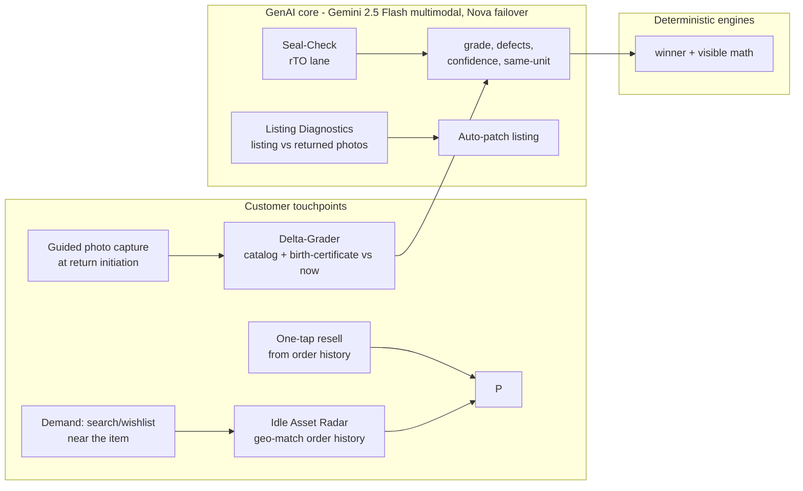

# Architecture — Amazon Second Life

## 1. System overview (demo build)

```
[Browser: web-console React UI on Vercel]
        │  HTTPS (VITE_API_URL)
        ▼
[AWS Lambda Function URL · ca-central-1 · FastAPI + Mangum, container via ECR]
        │
        ├── Seed store (repo-baked JSON + images): items, passports, orders,
        │   neighbors/demand, cached AI responses
        ├── Grading engine ──► Gemini 2.5 Flash (multimodal, primary)
        │                      └─(failure/timeout)──► Bedrock Nova 2 Lite (vision, failover)
        │                      └─(both fail)────────► cached response for item
        ├── VRS economics engine (pure Python — deterministic, auditable)
        ├── Pricing / time-decay / liquidity-curve module (pure Python)
        ├── Health Card assembler (passport + grade + invoice + warranty calc)
        ├── Idle Asset Radar (geo match over seeded order history)
        └── Passport event log ──► DynamoDB (if DYNAMODB_TABLE_NAME set)
                                   └─(unset/error)──► in-memory store seeded from JSON
```

**Design principle: the LLM is a perception layer. The money math is code.** The vision model (Gemini 2.5 Flash, Nova failover) sees photos and returns structured condition facts; the VRS engine turns facts into rupee decisions deterministically. This is what separates us from chatbot wrappers — and it's why the demo can show its math.

## 2. Mermaid diagram (use in PRD/deck)



## 3. GenAI core — the three vision calls

All three use the existing `llm.py` failover pattern, extended with image content blocks and JSON-constrained output. **Primary provider is Gemini 2.5 Flash; Bedrock Nova 2 Lite is the failover** (set via `LLM_PRIMARY`/`LLM_FALLBACK`; Gemini Pro's free tier quota-walls under demo load, Flash does not). `temperature=0.2` for grading (consistency > creativity). Gemini vision runs with `response_mime_type="application/json"` **and thinking disabled** (`thinking_budget=0`) — 2.5 Flash is a thinking model whose reasoning tokens otherwise eat `max_output_tokens` and truncate the JSON mid-object on harder cases. Every response is validated against a Pydantic schema; invalid JSON → one retry with the validation error in the prompt → then cached fallback.

**Grading prompt is delta-honest, not defect-biased.** The rubric grades *physical condition change vs day-0*, and the prompt explicitly tells the model to ignore differences caused by lighting, camera angle, distance, background, shadows, or image quality — only genuine wear/damage counts. (Earlier the prompt asked for "every visible difference," which dragged identical-but-recaptured photos down to B.) **Trust gate (`grading.grade_item`):** the result carries `needs_human_review` + `review_reason`, set when `same_unit.verified` is false, `same_unit.confidence < 0.50`, or overall `confidence < 0.70` — so a different/unknown product (or a non-product image) is flagged rather than passed off as a clean letter grade. The gate is non-blocking (the spine still routes); the frontend surfaces the warning.

### 3.1 Delta-Grader (`POST /grade`)
**Input images:** 1 catalog image + 2 birth-certificate (day-0) photos + 2–3 current photos.
**Prompt skeleton (final wording iterated in MT1):**
> You are a returns inspector. Compare the CURRENT photos against the CATALOG image and this unit's DAY-0 photos. Return ONLY JSON matching the schema. Tasks: (1) same_unit: is this physically the same unit as day-0 (markings, wear pattern, serial/label position)? (2) defects: list each visible difference from day-0 — area, description, severity minor/moderate/major. (3) completeness: check against: {per-category checklist}. (4) grade: A (like new) / B (light wear) / C (visible wear, functional) / D (damaged/incomplete). (5) confidence 0–1 and a one-line justification a customer would trust. Rubric: {category rubric}. Items worn/used then returned must be flagged `usage_detected`.

**Output schema:** `{same_unit: {verified, confidence}, grade, defects: [{area, description, severity}], completeness: [{item, present}], usage_detected, confidence, justification}`

### 3.2 Seal-Check (`POST /seal-check`) — RTO lane
One photo of the sealed package → `{sealed: bool, tamper_evidence: str|null, verdict: "SEALED_NEW"|"OPENED", confidence}`. Sealed → VRS adds the `rto_relist` path (skips grading entirely).

### 3.3 Listing Diagnostics (`POST /diagnose-listing`)
Listing photo + 2 graded-return photos + return-reason strings → `{discrepancies: [{aspect, listing_shows, returns_show}], patch: {field, current_text, suggested_text}, projected_return_reduction_pct}`.

## 4. VRS economics engine (deterministic Python)

`recovery(path) = sum(breakdown components)`, winner = argmax over eligible paths. Each path's `recovery` is the exact sum of its breakdown (positive sale/credit + negative costs) so the UI math always reconciles. **Constants LOCKED in MT2** (`backend/app/vrs.py` + `pricing.py`):

| Path | Sale price basis | Costs |
|---|---|---|
| `warehouse_relist` | resale × 0.92 (in-process depreciation) | reverse ship 120 + inspection 40 + relist 60 + FC handling 30 |
| `local_p2p` (interception) | resale × 0.95 | local hop 40 + payment 2% |
| `refurbish` | resale + repair_uplift | repair cost (per-category table) + local logistics 60 |
| `donate` | 0 | pickup 30 − CSR/tax credit (15% of fair value) |
| `liquidate` | MRP × 0.12 | bulk handling 20 |
| `rto_relist` (sealed only) | MRP × 0.90 | relabel 15 + local delivery 40 |

`resale = round(MRP × depreciation(category, age_months) × grade_factor × demand_multiplier)`.
- **grade_factor:** A 0.80 / B 0.65 / C 0.45 / D 0.25
- **depreciation:** linear `max(floor, 1 − rate×age_months)` per category — footwear (.040/.30), electronics (.030/.25), apparel (.060/.20), appliances (.025/.35), books (.050/.15), home (.030/.30), bags (.035/.25); default (.040/.25)
- **demand_multiplier** (seeded local buyers for the ASIN within 15 km): 0→0.90, 1–2→1.00, 3–4→1.10, 5+→1.15
- **time decay:** −5%/week unsold (drives `/health-card` price_decay and the `/price-curve` liquidity slider)
- **eligibility gates:** `local_p2p` needs ≥1 buyer ≤15 km; `refurbish` needs grade∈{C,D}, resale ≥₹600 and a repairable category; `rto_relist` needs a SEALED_NEW verdict — and a sealed RTO unit **skips grading**, routing as factory-new (grade A).

Each path returns its full cost breakdown — the frontend renders the math, not just the winner.

**Locked hero outcomes (computed live by the deployed engine, not hardcoded):** the ₹500 return shoe routes to **local_p2p at every grade** — grade D (current placeholder cache): local **+₹83** vs warehouse **−₹129**; grade C: **+₹181** vs **−₹31**; grade B (real worn-photo target): **+₹279** vs **+₹66**. The sealed RTO mixer (SL-004) routes to **rto_relist +₹2,464**, bypassing warehouse inspection. The thesis holds across grades: the ₹250 reverse-logistics fixed cost destroys low-value returns; a local hop recovers most of the value.

## 5. Demo-safety: seed data + fallback (nothing on stage can fail)

- **Seed store (repo-baked, in `backend/app/seed/`):** `items.json` (8 curated items: metadata, MRP, age, category), `orders.json` (Rahul's order history + 12 dormant units of the monitor ASIN within 5 km), `neighbors.json` (~30 synthetic local buyers with wishlists/notify-me), `size_signals.json` (MT7 — per-ASIN fit social proof for footwear/apparel), `seller_catalog.json` (MT7 — per-SKU sell-through + return counts), `images/` (catalog + day-0 + current photos per item, also copied to `frontend/public/items/`).
- **Cache layer:** for every seed item, real grading/seal/diagnostics responses are captured once during build and committed as `cached/{item_id}.{call}.json`. At request time: try Gemini 2.5 Flash (18s timeout) → on failure try Bedrock Nova → on failure return the cached response with `"source": "cached"`. The UI renders identically; a failed live call on stage is invisible. (Re-capture with `scripts/capture_cache.py` whenever the model or prompt changes, or when real demo photos land.)
- **Live-call policy for the video/stage:** 2–3 hero items run live; the rest serve cached. Never demo an un-tested item (no live judge-item scans).
- **DynamoDB optional:** passport events write to DynamoDB only if `DYNAMODB_TABLE_NAME` is set (see docs/db-setup.md); otherwise an in-memory store seeded from JSON. Cold-start state loss is irrelevant for a demo run.

## 6. Changes vs the deployed boilerplate

| Keep | Why |
|---|---|
| Lambda container + ECR + deploy.ps1, ca-central-1, Function URL | deployed & verified; Bedrock throttle-free region |
| `llm.py` failover (Gemini→Bedrock), timeout-bounded calls | both providers are vision-capable — failover covers multimodal |
| App-level CORS via `ALLOWED_ORIGINS` | single source of truth |
| React+Tailwind on Vercel, `VITE_API_URL` | auto-deploy on push |

| Add | Why |
|---|---|
| `seed/` module + images + cached AI responses | demo-safety spine |
| `grading.py` (multimodal calls + schemas), `vrs.py`, `pricing.py`, `passport.py`, `radar.py`, `healthcard.py` | the product |
| ~10 new endpoints (docs/api-spec.md) | the demo API |
| `boto3` DynamoDB client behind env flag | passport persistence, optional |
| Phone-frame UI replacing the chat page | inside-the-order-flow surface |

| Remove/demote | Why |
|---|---|
| `/chat` endpoint + chat UI | boilerplate; keep endpoint (harmless) but no UI surface |

## 7. Production architecture (the scaling story for judges)

App/PDP → API Gateway → Lambda → **Step Functions** pipeline (grade → route → list) triggered by **S3** photo upload via EventBridge → **DynamoDB** passport event log (item_id PK, event timestamp SK; GSI on ASIN+geohash for radar queries) → SQS human-review queue for sub-threshold confidence → buyer-confirmation events feed back as labeled training data. Serverless horizontal scale: 100× volume with zero re-architecture; geo-agnostic (explicitly not local-only). Resale is **inventory-of-one**: discovery is matching/feeds/alerts over the demand graph, not search — which is why radar + pings, not a storefront.

## 8. Two-sided console — Prevent → Recover → Recirculate

The console covers the full lifecycle a product can hit, reached through three entry points on the web landing (Buyer · Seller · Ops). **Recover** is the ⭐ spine, untouched. The other two phases both **mock the data, not the architecture** — every figure traces to a real endpoint backed by a seed JSON + a thin route, never hardcoded JSX.

- **Prevent (buyer)** — `GET /size-advice/{asin}` (`size.py` + `size_signals.json`): fit social proof on the PDP ("68% of UK-8 buyers sized up") so fewer fit-driven returns ever happen. The resale hint in the same payload is deterministic `pricing.resale_value`, not seeded.
- **Prevent (seller)** — `GET /seller/returns` (`seller.py` + `seller_catalog.json`): a worst-first return-rate dashboard. Tapping a high-return SKU **reuses `/diagnose-listing`** (no new LLM call) for the AI fix + projected drop; the cached shoe diagnosis (`SL-001.diagnose.json`) was added so both hero SKUs drill down.
- **Recirculate (buyer)** — `GET /orders/{persona}` (`orders.py`, reads `orders.json`): order history with a `resellable` flag. One-tap resell on the idle monitor flows into the **existing** `/radar` → `/price-curve` lane — the Rahul beat, now with a real origin (his own purchase) instead of starting in the Ops inbox.
- **Buy (buyer, MT11)** — `GET /second-life/{asin}` (`second_life.py` + `seed/second_life_offers.json`): the buy-side twin of "layer, not app." A normal PDP surfaces 1–2 recovered units of the same product *near the shopper* — so the buyer **meets** a Second Life unit in the regular buy flow, not a separate Renewed storefront (the part incumbents get wrong). `price` is computed by `pricing.resale_value` (the same engine the sell side uses); `grade`/`distance`/`eta` are seeded facts. Closes the loop between everything the supply side recovers and a buyer who actually sees it.

All of these are stateless reads (no passport prereq, no `*Safe` wrapper). Frontend reuses the MT3 design system + the MT4 `RadarScreen`/`LiquidityScreen`/`DiagnoseScreen` (zero new deps). Backend redeploy required (`deploy.ps1`), unlike the frontend-only MT4. *(MT11 also adds `POST /metrics/reset` — a presenter tool that clears the per-instance counter back to baseline for a stable, repeatable stage number; not wired to any UI.)*

## 9. Value cascade — the derived terminal-state waterfall

Judges arrive with Optoro's tiered-waterfall mental model ("dark store → wholesale → liquidation over time"). We already hold both halves: the **VRS argmax** (which channel) and **−5%/wk time-decay pricing** (how value erodes). MT8 composes them into one **derived** artifact — no fixed timer, no hardcoded tiers — keeping the locked ⭐ spine untouched.

- **Dark-store node:** the `local_p2p` path *is* the hyperlocal open-box channel (the reference doc's "dark store as open-box"). MT8 attaches the nearest Amazon Now MFC (`seed/dark_stores.json`, 4–5 seeded MFCs, nearest-distance) as `dark_store: {id, name, distance_km}`, so the winner reads "→ Amazon Now dark store DS-14 · open-box," not a generic "local hop." Items that DON'T qualify for this node (no buyer ≤15 km, assortment/value too low) are exactly the ones the cascade falls past to the lower tiers — the visible answer to "what happens to everything that isn't dark-store-eligible."
- **Derived cascade (`GET /cascade/{item_id}`, `cascade.py`):** re-runs the VRS argmax week-by-week as the resale price decays; emits a tier each time the winning channel flips; terminates at `donate` (CSR certificate) once no monetary path clears the donate credit. The waterfall — dark-store open-box → central relist → wholesale/liquidate → donate — is therefore a *consequence of the same money math the judge just watched*, not an arbitrary schedule. Pure-Python deterministic (reuses `vrs.py` + `pricing.py`): no LLM, so nothing to cache and nothing that can fail live. Richer on higher-value items (the monitor cascades through more tiers than the ₹500 shoe — an honest property of the economics, not a bug).

This is narrative legibility over the locked spine, not new machinery: MT8 adds one seed file, one derived read endpoint, and a frontend strip. The ⭐ spine is untouched. Anti-pattern explicitly avoided: items are NOT speculatively *parked* in a dark store (which would consume scarce, velocity-optimized shelf space) — they are listed as available-from-the-nearest-MFC the instant they're graded, and the cascade only steps the channel/price down if no local buyer takes the item.

## 10. Web console + photo upload + buyer storefront

MT9 is a **presentation change, not a feature change**: the demo moved off the 390px phone frame into a real **web console** so a judge reads it instantly. `WebShell` (a persistent Amazon-navy brand bar + a centered `max-w-6xl` content column) replaces `PhoneFrame`; the per-screen `TopBar` became a light page header; `.screen-scroll` became a centered reading column and wide screens (home, storefront, seller table) use `.screen-page`. The `App.jsx` state machine, `lib/api.js`, the Tailwind `@theme` tokens, the CSS animations, and **all backend logic** are unchanged. Zero new deps; the ⭐ spine (scan→grade→route→card→radar) is regression-clean.

Two genuinely new pieces:
- **Hybrid photo upload on grading** — the returns desk is a two-pane scan station: LEFT the day-0 baseline on file, RIGHT an upload dropzone. `POST /grade` gained optional `current_images` (base64, ≤3, ≤~1.5 MB each decoded; frontend downscales to ~1024px via a canvas helper, `lib/image.js`). Uploaded photos are graded *live* (Nova-2 → Gemini → cached floor) as the CURRENT set against the seeded catalog + day-0; no upload → seeded current photos, so the flow never blocks. `grading._grade_live(item, current_override)` decodes/validates up front (oversize → `422`) so a bad upload fails before any LLM call. The response carries `graded_uploaded_photos`.
- **Buyer storefront (Rahul)** — `buyer.py` + `seed/buyer.json`: `GET/POST /cart/{persona}` (per-instance overlay, server-computed total), `GET /notifications/{persona}` (the idle-monitor resell nudge → existing radar flow), `POST /checkout/{persona}` (demo UPI collect: `pending` → `success`, then the cart empties). All API-backed — the iron rule holds; a judge can open the network tab. The frontend pins the approved order id + amount across the pending→success flip because the cart is per-instance (a confirm landing on another warm Lambda could recompute a different total — same per-instance caveat as the passport).

The seller dashboard reskinned to a wide return-rate table over the existing `/seller/returns`; PDP, radar, liquidity, diagnose, health-card, route, metrics screens were reused and widened, logic untouched. The §8 persona switch is the web landing's three entry points feeding the same `WebShell`.

## 11. Returns desk, resell, and the flash-deals board

The Ops returns desk, the buyer resell flow, and the cross-tab flash-deals board. The iron rule holds — every number traces to an endpoint (seed JSON + a thin route), never hardcoded JSX. The ⭐ spine (SL-001 grade→route→card→radar) is untouched.

- **Return window (Fix 1, `orders.py`):** each order carries `return_window_open` / `return_by` / `days_left` — a 10-day window from `purchase_date` against the fixed demo date `2026-06-13`. The buyer's Return button is active only inside the window; old orders read "window closed." Two recent orders were seeded so the window is demoable (one is a Vastram apparel item that also feeds Fix 3).
- **Ops returns desk + buyer→ops link (Fix 2, `returns.py` + `seed/returns_seed.json`):** the Ops desk shows ONLY return-class items (`/items` `return_initiated`) + a returns store, and the COD-refused/RTO item — the idle/radar (SL-002) and seller-diagnose (SL-003) lanes moved out to the Buyer/Seller views, de-mixing the desk. The store is seeded with placeholder extras and accepts `POST /returns`, so a buyer-initiated return from order history lands on the desk (`source:"buyer"`). In-memory per-instance (cart pattern). Extra/dynamic rows are display-only "queued for grading" (only the SL-001 hero is the live-gradeable spine — keeps the demo bulletproof on photoless items).
- **Personalized size advice (Fix 3, `size.py` + `seed/purchase_profile.json`):** `GET /size-advice/{asin}?persona=` adds a `personal` block matched to the buyer's past purchases by brand (first word of the title) or category — "you bought a Vastram M; this cut runs slim, size up to L." The generic social-proof `fit` block is unchanged; no persona/no match → `personal:null`.
- **Resell redesign (Fix 4, `resell.py`):** order-history Resell now flows confirm sheet → photo upload (reuses `/grade current_images`, the grade drives the price) → price+range screen → list → public flash-deals board → live cross-tab interest. `POST /resell/quote` is pure-Python over `pricing.py` + `seed.buyers_for_asin`: a wider `range_km` reaches more local buyers (higher achievable `best_price` via the demand multiplier) but Amazon's `delivery_cut = 25 + 6·range_km` grows with reach, so `net` peaks mid-range (the monitor: net 935 @3km → **1009 @7km** → 961 @15km — the trade-off the seller tunes). Listings + interests are an in-memory per-instance store (seeded with 2 starter listings); a buyer taps "I'm interested" on the board (`POST …/interest`) and the reseller's "My resells" view polls `GET /resell/listings/{id}` (~3s) and shows the buyer arrive — **real cross-tab** (rock-solid locally; one warm Lambda in the demo). The old idle-radar resell beat (SL-002 notification nudge → `/radar` → `/price-curve`) is unchanged.

**Persistence.** Returns, listings, interests, and the cart write through to DynamoDB when `DYNAMODB_TABLE_NAME` is set (the same single-table store as the passport, via `store.py`), so they survive a cold start and are shared across parallel instances. When the table is unset — or a DynamoDB call fails — they degrade to an in-memory per-instance store, so local dev and the demo never block on the database (see §15).

## 12. Life-stage, fault attribution, and returns on the marketplace

Correctness and depth additions on top of the spine. The iron rule holds throughout (every on-screen number traces to an endpoint); the ⭐ SL-001 spine is regression-clean (`local_p2p +₹83` vs `warehouse −₹129`, confirmed on the deployed Function URL).

- **Life-stage prediction is now real (NEW 1, `lifestage.py` + `seed/lifestage_curves.json` + `GET /life-stage/{asin}?persona=`):** the time-based twin of the demand radar. A per-category stage curve (with asin overrides, e.g. a baby monitor → an 18-month baby-gear stage) + the owner's real purchase date yield `months_owned`, `stage_pct`, `due_to_resell`, and a **derived** `current_value`/`decay_per_month` from `pricing.resale_value`. The hero resell notification body is rendered from this payload (`buyer.get_notifications` enriches `kind:"resell"`), retiring the old hardcoded "idle 19 months / ₹X dropping" string.
- **Two-way fault attribution (NEW 10, `grading.py`):** the grade carries a second identity check `catalog_matches_day0` alongside `same_unit`, deriving `fault_attribution` ∈ {none, seller, customer} + `returnable`. Catalog ≠ day-0 → seller mis-listed (still returnable); current ≠ day-0 → customer swapped (not returnable + review). `Grade.jsx` surfaces a seller/customer banner. Cached grades updated to the new shape.
- **Returns flow onto the marketplace (NEW 9/12, `resell.py` + `POST /resell/from-route/{id}`):** a graded return whose VRS winner is `local_p2p` is listed on the public Flash-deals board (price = engine `resale_value`, grade/confidence from the GRADED event, `source:"return"`). Listings now carry `grade`/`confidence`/`source`; a new `FlashDealDetail` screen shows the condition photos + AI grade + confidence before a buyer expresses interest.
- **Honesty/UX batch (frontend):** require an upload before grading + show the **uploaded** photos on the grade screen (NEW 6); resell requires an upload and **blocks a mismatched item** (NEW 11); order history splits into Return / Replace / Resell (Replace = "pickup arranged", NEW 4); day-0 reframed as **seller-captured at listing** (NEW 5); confidence relabeled "Prediction confidence" (NEW 7); the Recovery-Path screen redesigned to lead with **where it goes + the ₹ swing + km saved** (NEW 8, all figures still from `/route`). Seed reconciles (NEW 2/3): every product named in the size card now also appears as an order row, with distinct brands (Stride vs Aurelle) for a cross-brand sizing story.

## 13. Trust & the closing loop

The buyer-confirmation loop, server-side return listing, and electronics → Amazon Renewed routing. Iron rule held, ⭐ SL-001 spine regression-clean (`local_p2p +₹83` vs `warehouse −₹129`, confirmed live on the Function URL).

- **Resell sold → buyer "Order confirmed" (fix-1, frontend-only).** When the reseller accepts an interested buyer (`resell.sell_to_interest`, already built), the buyer's own session was watching: `FlashDealDetail` reports the `interest_id` it just created up to `App`, which polls `/resell/listings` and, the moment that interest flips to `accepted` (listing → `sold`), fires an "Order confirmed" popup + a sticky buyer-side notification. No new economics, no backend change — the accepted-interest status was already in the listing payload. Same one-warm-instance cross-tab caveat as the rest of the board; rock-solid locally.
- **Returns → Flash deals, server-side (fix-4).** The board listing for a graded return that wins `local_p2p` is now created **inside `/route`**, atomic with the `ROUTED` event on the same warm instance (`vrs.route_item` → `resell.list_from_route`, idempotent, best-effort). The old frontend `POST /resell/from-route` fired from `App.runRoute` could land on a *different* warm Lambda with no `ROUTED` event and silently no-op (per-instance store) — that race is gone; the frontend POST was dropped.
- **Electronics → Amazon Renewed (fix-2 + fix-3).** `vrs.build_paths` gates the `dark_store` (Amazon Now quick-commerce) attachment by category: `RENEWED_CATEGORIES = {"electronics"}`. Everyday goods keep the dark-store node; electronics' eligible `local_p2p` path instead carries `renewed_channel` (certified-refurbished), and the route exposes a top-level `quick_commerce_eligible` bool. **No economics change** — recovery still sums from the same breakdown; only the named destination differs (`RouteScreen` shows "Moved to quick commerce · Amazon Now · {MFC}" vs "Amazon Renewed · certified"). The trust hook is a seeded `usage_cert` block (battery health + charge cycles) on electronics catalog items, surfaced on the Health Card. An electronics order (SonicWave headphones) was added to Rahul's history so the path is demoable: Return → Ops desk → grade B → route → Renewed + battery-cycle Health Card line.

### Roadmap (deferred, design-only — see PRD §7)
- **#1 Buyer-verified closing loop (§3.6):** the buyer of a second-life unit taps "Yes, condition matches Grade X" → ~₹15 credit; every tap is a free human label auditing the AI grade — *the only grading model audited by a human on every sale.*
- **#10 Review-informed inspection checklists (§18.2):** mine a SKU's own customer reviews (one extra LLM call) to auto-build its per-item inspection checklist.
- **#2 Agent-as-grader / Agent Flip (§3.3, §4.3):** the delivery agent grades at the doorstep during pickup; Agent Flip posts the graded unit straight to that route's flash deals.
- **#12 Usage-data certification (§5.3):** the deep version of the battery-cycle hook — the Health Card quantifies verified device usage (battery cycle count, sensors verified) for electronics.

## 14. Make the invisible warehouse visible

The owner-side dormant-inventory view and the per-persona green ledger. Iron rule held (every rupee derived from the engine, no hardcoded JSX), ⭐ SL-001 spine regression-clean. Both endpoints are pure deterministic Python — no LLM, no cache — so they can't fail live.

- **"Your Things" — owner-side dormant inventory (`GET /your-things/{persona}`, `your_things.py`).** Every product a persona has bought, valued live as idle resale stock: a still-owned, well-kept unit is graded at a like-kept `B` and depreciated by age through `pricing.resale_value(mrp, category, months_owned, "B", 1.0)`; the next-month value gives the `decay_per_month`. The life-stage curve (`seed.lifestage_curve` + `lifestage.DUE_FRACTION`, shared with `/life-stage`) supplies `stage_pct`, `stage_label`, and a `due_to_resell` flag. The response totals `total_dormant_value` across all things and sorts highest-value first — "the dormant value your home is holding," the **pull twin** of the demand-driven Idle-Asset Radar (which pushes from the buyer side). Only catalog-resolved items are `resellable`, so the per-thing Resell CTA routes straight into the existing resell flow (`App.startResell`). Frontend: a new `YourThings` screen (dormant-value hero + per-thing cards with a life-stage bar) reachable from the buyer storefront's "Your things" tab.
- **Personal Green Ledger (`GET /green-ledger/{persona}`, `green_ledger.py`).** The global `/metrics` impact (CO₂ / landfill / items diverted) scoped to one persona's own products — derived from that persona's `ROUTED` passport events plus a small seeded baseline (mirrors `metrics.BASELINE`) so the strip reads non-zero before the live demo; reuses `metrics.LANDFILL_KG`. Surfaced **subtly** as a small `GreenLedger` strip (a line, not a hero panel) on both the buyer's Your Things hero (dark tone) and the seller dashboard (light tone). Renders nothing until the data lands, so it never breaks layout.

### Roadmap (deferred, design-only — see PRD §7)
- **#3 Hidden QR resale + gift transfer (§2, §18):** every product ships a QR; a scan opens a prefilled resale page, and a gift recipient's scan transfers passport ownership so they can resell an item never in their own order history.
- **#4 Brand layer (§18.5):** brands get right-of-first-refusal on their own returns + fund trade-in boosts, surfaced on the seller dashboard.
- **#8 Pickup piggybacking (§8.4):** an agent already driving to an address is shown nearby dormant items to collect on the same trip (~₹0 marginal cost).
- **#9 Season-aware routing (§8.6):** demand timing becomes a VRS input (hold a winter jacket, or route it to a still-cold region; festival spikes raise local resale price) — one line in the VRS math.
- **#14 Material-stream routing (§18.7):** genuinely-dead items route by material (cotton → textile recyclers, electronics → e-waste) into India's EPR law → sellable compliance certificates.
- **Grow Cycle subscription (§7.2):** a swap subscription for outgrowable categories (baby gear, kids' shoes) — outgrow → agent collects + relists the old, delivers the next size up.
- **Micro-liquidation bidding (§4.7):** local kiranas / neighbourhood resellers bid on individual items in their pin code (40%+ recovery) vs bulk-pallet liquidation (10–15%) — the lowest cascade tier as a local market.

## 15. Data & persistence

**The Product Passport is the data primitive, not a feature.** Every product gets a persistent identity at first sale; returns, grades, routes, and ownership transfers are events appended to it. Nothing is ever "relisted," because nothing was ever delisted. The implementation is an append-only event log — explicitly not a blockchain.

**Single-table design.** One DynamoDB table (`SecondLifePassport`, partition key `item_id`, sort key `ts`) holds the passport events. `store.py` reuses the same table for the demo stores via synthetic partition keys (`LISTING`, `RETURNS`, `CART#<persona>`), so listings, returns, and carts persist without a second table — only `dynamodb:GetItem` had to be added to the role (the passport already used `Query`/`PutItem`).

**Graceful degradation is the rule, by construction:**

- When `DYNAMODB_TABLE_NAME` is **unset**, `store.py` never touches boto3 — writes are no-ops, reads return empty. Local dev and the test suite are byte-identical to a no-database run.
- When the table **is set**, every write is fire-and-forget and every read returns `[]`/`None` on failure, with short timeouts. A DynamoDB problem degrades to the old per-instance behaviour instead of blocking the demo.
- The passport keeps `get_events` in memory (so `/metrics` and `POST /metrics/reset` stay fast and local) but reads `latest_event` back from DynamoDB on a miss — the precise fix for the cold-start / parallel-instance race where a grade succeeds on one instance and the follow-up `/route` lands on another. Event timestamps are microsecond-resolution so two same-second events don't collide on the `(item_id, ts)` key.

**What stays ephemeral.** Uploaded photos (~300 KB of base64 each) exceed the 400 KB DynamoDB item limit, so they live in an in-memory `uploads.py` for the duration of the warm instance — the Health Card is built in the same flow right after grading. The grade *facts* (small, durable) persist; the bulky presentational bytes don't. S3 is the production home for the images.
